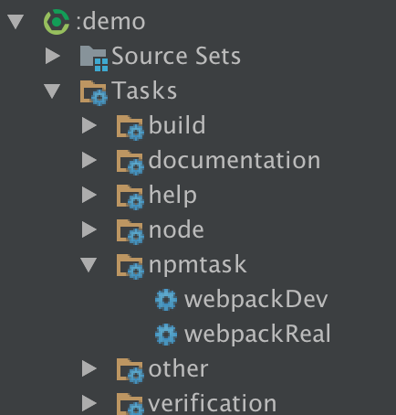

# Kingbbode Gradle Plugins 

### Npm Task Generator Plugin(COMING SOON...)

[  ](https://bintray.com/kingbbode/gradle-plugins/gradle-npm-task-generator-plugin/_latestVersion)

#### Usage

```
buildscript {
  repositories {
    jcenter()
  }
  dependencies {
    classpath 'com.github.kingbbode:gradle-npm-task-generator-plugin:1.0.0'
  }
}

apply plugin: 'gradle-npm-task-generator-plugin'
```

#### Example

```
npmTasks {
    webpackReal {
        command = 'run real'
        description = 'build webpack dev profile'
        npmInstall = true
        dependsOn = JavaPlugin.PROCESS_RESOURCES_TASK_NAME
        
    }
    webpackDev {
        command = 'run dev'
        description = 'build webpack real profile'
        npmInstall = true
        dependsOn = JavaPlugin.PROCESS_RESOURCES_TASK_NAME
    }
}
```



##### Option 

```
npmTasks {
    name {
        command = 'install' // npm install
        description = '~~'
        npmInstall = true // default false, this task dependsOn NpmInstallTask
        dependsOn = '' // find task and dependsOn this task.
    }
}
```